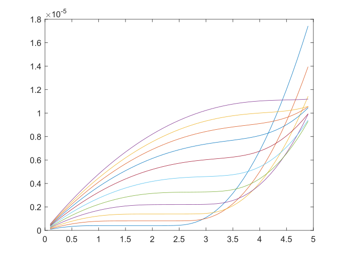
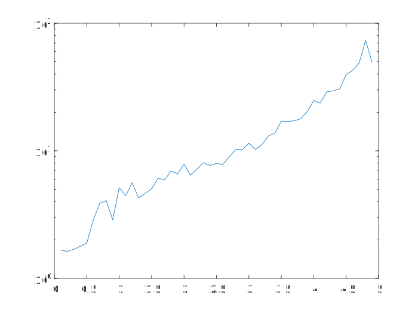
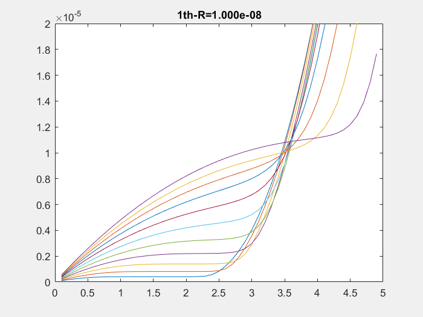
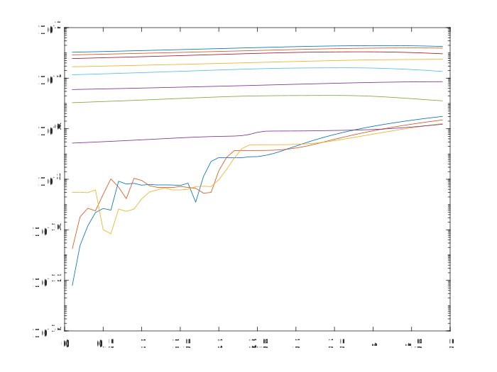
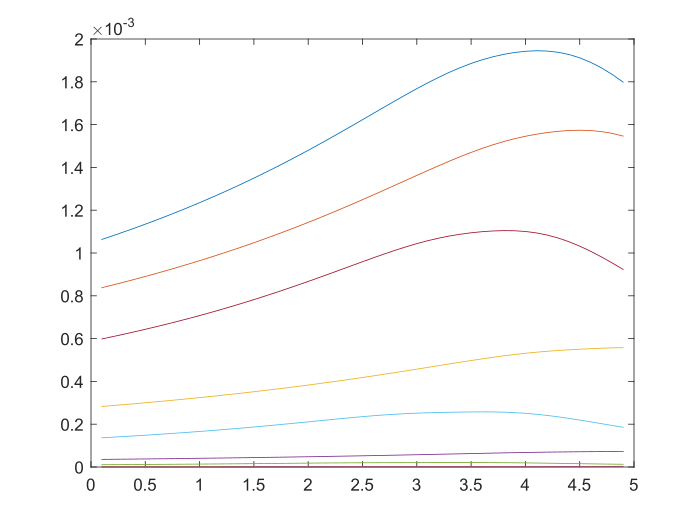

# Solving Drift-Diffusion Equations

Run the programs as following order:

## main_ode_script_mat0.m

* search the easy solutions from weak recombination (controlled by ``mag_R``) and moderate acc (by ``acc`` and ``acc1``)

* try-catch is used to prevent the program stopped by failing in convergence. And, this setting is maintained until the statement is patched as 

    ```matlab
    warnings(s)
    ```

* iterative direction is along Vds with Vgs kept fixed one-by-one

* linear projection technique is used along the Vds-iteration, which is packaged as a function ``interp_sol``
    ```matlab
    %% solx, (a,b) --> x
    a_vgs=Vgs;
    a_vds=vdslis(i-2);
    a_sol=sollis(i-2);

    b_vgs=Vgs;
    b_vds=vdslis(i-1);
    b_sol=sollis(i-1);

    x_vgs=Vgs;
    x_vds=vdslis(i);
    x_sol=interp_sol(a_vgs,a_vds,a_sol, ...
                    b_vgs,b_vds,b_sol, ...
                    x_vgs,x_vds);

    ```

* data structure: matrix: ``idsmat, timmat, solmat`` is compressed as vector ``idsvec, timvec, solvec``, respectively, so that vds and vgs are mixed as one dimension.

* usage: decrease ``mag_R`` and find the maximum workable value.

## main_ode_script_matR.m

* run ``parfor`` loop to parallel iterative ``mag_R`` as the second dimension.

    ```matlab

    parfor i=1:max(14,cub_rows)
    % bias -- def2
    vgsswp=(3:0.3:6);
    vgslen=length(vgsswp);
    vdslis=(0.1:0.1:4.9)';
    vdslen=length(vdslis);
    % assign
    [idx_vds,idx_vgs]=vec2squ(vdslen,vgslen,i);
    vds=vdslis(idx_vds);
    vgs=vgsswp(idx_vgs);

    for j=1:mag_Rlen
    mag_Rlis=10.^linspace(-8,0,mag_Rlen);
    mag_R=mag_Rlis(j);
    if j==1
        sol_init=solvec(i);
    else
        sol_init=sol1;
    end
    tic
    sol1=main_ode(acc,acc1,mag_R,gausf(vgs),vgs,vds,sol_init);
    timcub(i,j)=toc;
    x_vgs=vgs;x_vds=vds;
    solw=mean(sol_post(gausf(x_vgs),sol1,x_vgs,x_vds).ids);
    idscub(i,j)=solw;
    end

    end


    ```

    collect the data:
    ```matlab
    % bias -- def3
    vgsswp=(3:0.3:6);
    vgslen=length(vgsswp);
    vdslis=(0.1:0.1:4.9)';
    vdslen=length(vdslis);

    idsedg=idscub(:,end);
    idsmat_edg=idsmat;

    for z=1:cub_rows
        [zi,zj]=vec2squ(vdslen,vgslen,z);
        idsmat_edg(zi,zj)=idscub(z,end);
    end

    timtri=zeros(vdslen,vgslen,mag_Rlen);
    for z=1:cub_rows
        [zi,zj]=vec2squ(vdslen,vgslen,z);
        for zz=1:mag_Rlen
        timtri(zi,zj,zz)=timcub(z,zz);
        end
    end

    timpst=mean(sum(timtri,3),2);
    ```

    and then plot

    ```matlab
    figure
    plot(vdslis,idsmat_edg)

    figure
    semilogy(vdslis,timpst)
    ```
    
    
    
    

## main_ode_script_matR_pst.m

* use the results calculated above to generate the convergence track:

    

## main_ode_script_matR_pst_acc.m

* compute the relative error (log)

    


* compute the relative error (linear)

    


